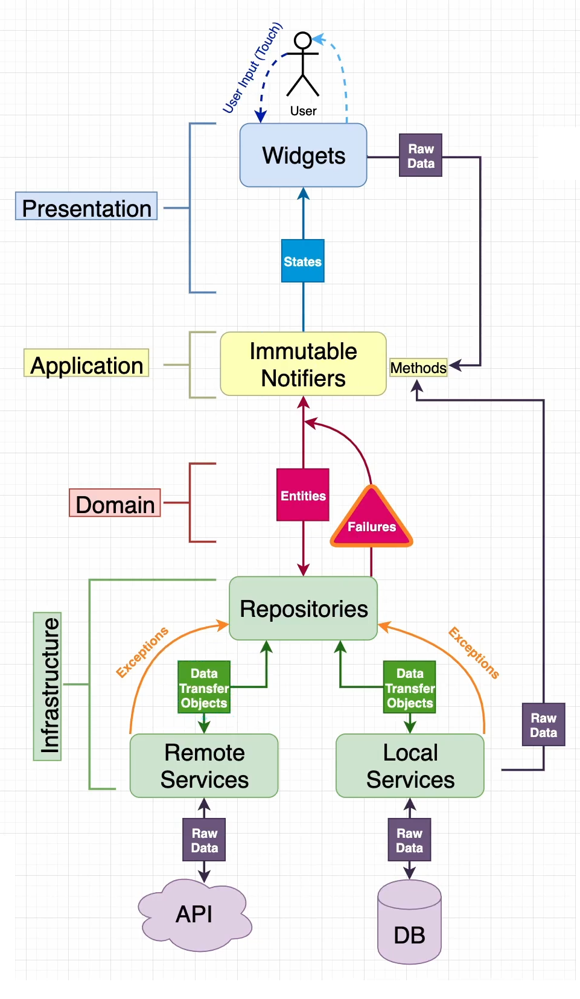
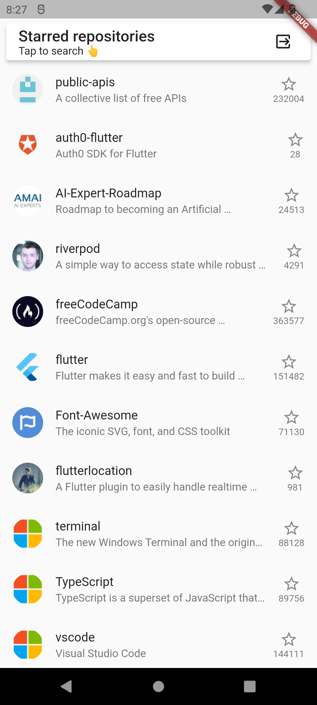
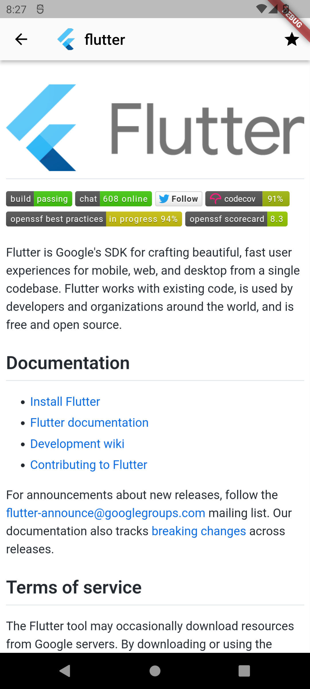

# Reso Coder GitHub Repo Viewer

Production-grade project developed during the Reso Coder Academy Flutter Bootcamp.

This project is a GitHub repository viewer app that allows users to search for repositories and view their details.

More info at [Reso Coder](https://resocoder.com/fdb) or at [Reso Coder Academy](https://resocoder.academy)

## Architecture by Reso Coder



## Setup

**Step 1:**

Download or clone this repo by using the link below:

<https://github.com/azeunkn0wn/repo_viewer.git>

**Step 2:**

Go to project root and execute the following command in console to get the required dependencies:

```sh
flutter pub get
```

**Step 3:**

This project uses libraries that works with code generation, execute the following command to generate files:

```sh
flutter packages pub run build_runner build --delete-conflicting-outputs
```

or watch command in order to keep the source code synced automatically:

```sh
flutter pub run build_runner watch --delete-conflicting-outputs
```

**Step 4:**

Go to Github Settings > Developer Settings > OAuth Apps and create a new OAuth app.

Set the Homepage URL to ```http://localhost:8080``` and the Authorization callback URL to ```http://localhost:3000/callback```

Create a new text file or edit the existing ```.env.example``` in env folder

Copy the Client ID and paste it to GITHUB_CLIENT_ID below.  

```text
GITHUB_CLIENT_ID=your_github_client_id
```

Generate a new client secret, copy and paste it to GITHUB_CLIENT_SECRET below.

```text
GITHUB_CLIENT_SECRET=your_github_client_secret
```

Go back to developer settings and go to Personal access tokens.

Generate a new token (classic).
In Scopes, select all `repo` and `user:read`.

Click Generate token. Copy the token and paste it to GITHUB_ACCESS_TOKEN below.

```text
GITHUB_ACCESS_TOKEN=your_github_access_token
```

Save the file as `.env.development` or `.env.production` in `env` folder.

The `.env.development` file will be used when running the app in debug mode.

The `.env.production` file will be used when running the app in release mode.

The `.env` will override both .env.development and .env.production files.

## Running the app

Go to project root and execute the following command in console to run the app:

```sh
flutter run
```

This app supports both Android and iOS. Web support is not yet covered in the course. I will add web support in the future.

## Testing

The course does not include testing, but I will add some tests in the future.

## Screenshots



